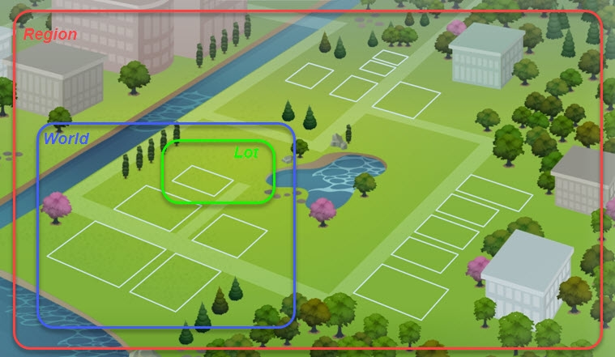

<h1>Binary Templates</h1>

<!-- TOC -->

- [Binary Templates](#binary-templates)
- [Game File Geography Lingo](#game-file-geography-lingo)
- [String Table Locale Codes](#string-table-locale-codes)
  - [Locales supported by The Sims 4](#locales-supported-by-the-sims-4)
- [Textures in `UI.package`](#textures-in-uipackage)

<!-- /TOC -->

## Binary Templates
See above for binary templates for use with [010 Editor](https://www.sweetscape.com/).

## Game File Geography Lingo
Internally, the game refers to some things using different terminology than its UI does.

| What players see | What the game files call it
| - | -
| Lot | Lot
| Neighborhood | World
| World | Region



## String Table Locale Codes
Example string table resource key:
```
[Type    ] [Group   ] [Locale][Remaining Instance]  
 220557da : 80000000 : 0f      796a70fbc234cd
```

Notes about the above example:
* all string table resources will have the shown type;
* all non-Maxis string table resources are recommended to have the shown group and should **never** have group `00000000` to avoid conflicts with Maxis;
* the key above indicates that this resource is for Polish (`0f`);
* all other languages supported should have string tables with their locale prefixes, but the exact same remainder, in this case, `796a70fbc234cd` (string tables you create can have any remaining instance, it's just that they should have the same remaining instance so that their locales can be properly united).
  
### Locales supported by The Sims 4
| Locale | ISO 639-1/ISO 3166-1 | Native Name | English Name |
| - | - | - | - |
| `00` | en_US | English (United States) | English (United States) |
| `02` | zh_TW | 繁體中文 (台灣) | Traditional Chinese (Taiwan) |
| `03` | cs_CZ | Čeština (Česká republika) | Czech (Czech Republic) |
| `04` | da_DK | Dansk (Danmark) | Danish (Denmark) |
| `05` | nl_NL | Nederlands (Nederland) | Dutch (Netherlands) |
| `06` | fi_FI | Suomi (Suomi) | Finnish (Finland) |
| `07` | fr_FR | Français (France) | French (France) |
| `08` | de_DE | Deutsch (Deutschland) | German (Germany) |
| `0b` | it_IT | Italiano (Italia) | Italian (Italy) |
| `0c` | ja_JP | 日本語 (日本) | Japanese (Japan) |
| `0d` | ko_KR | 한국어 (대한민국) | Korean (South Korea) |
| `0e` | nb_NO | Norsk Bokmål (Norge) | Norwegian Bokmål (Norway) |
| `0f` | pl_PL | Polski (Polska) | Polish (Poland) |
| `11` | pt_BR | Português (Brasil) | Portuguese (Brazil) |
| `12` | ru_RU | Русский (Россия) | Russian (Russia) |
| `13` | es_ES | Español (España) | Spanish (Spain) |
| `15` | sv_SE | Svenska (Sverige) | Swedish (Sweden) |

## Textures in `UI.package`
The textures in `UI.package` use the YCoCg color space instead of RBG and each texture has two associated resources in the package, both in ATI2N format.
Texture # 1 (group ID 0x00064dca) is full-sized and contains luminance and alpha.
Texture # 2 (group ID 0x00064dc9) is half-sized and contains the two chroma channels.